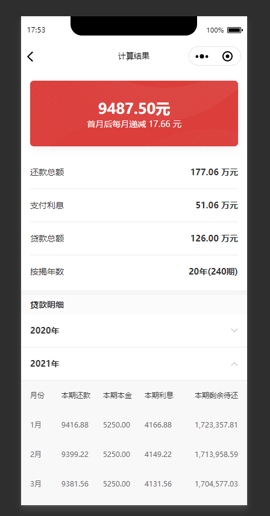

# Taro 房贷计算器

## 截图



## 开发
```bash
yarn

# 复制修改开发文件
cp dev.example dev

# 小程序开发
yarn run dev:weapp

# h5开发
yarn run dev:h5

# 检查代码风格并修复
yarn run lint --fix
```

## 页面参数
pages/calculator/index 和 result 页面均可以接受初始化参数

```typescript
export type Params = {
  method: 'commercial' | 'housing' | 'mix' // 贷款方式 商业 公积金 组合贷
  totalPrice: number, // 总价
  downPayment: number, // 首付
  paymentMethod: 'eci' | 'ec' // 等额本息 等额本金
  housingValue: number, // 公积金贷款总额
  commercialValue: number, // 商业贷款总额
  years: number, // 贷款年限
  startAt: string, // 开始时间
  housingRateBase: number, // 公积金贷款基本利率
  housingRateFactor: number, // 公积金贷款利率乘数
  commercialRateBase: number, // 商业贷款基本利率,
  commercialRateFactor: number, // 商业贷款利率乘数,
}
```

## 参考文档
1. Taro https://nervjs.github.io/taro/docs/README.html
1. Nerv https://nervjs.github.io/docs/
1. Mobx https://cn.mobx.js.org/
